### Виды деятельности  
  
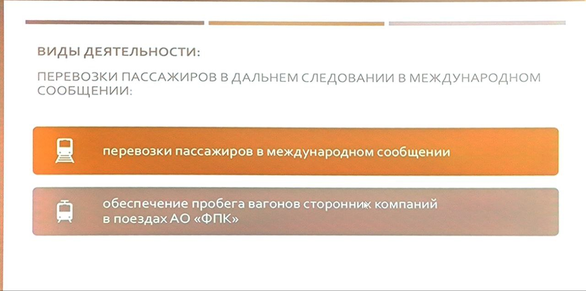  
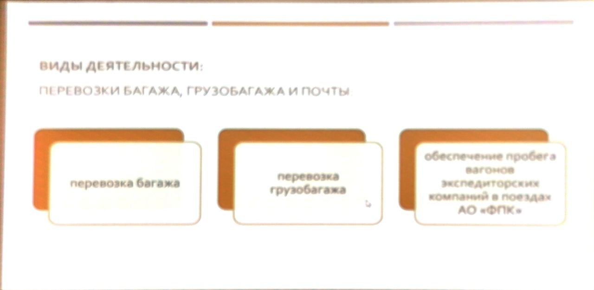  
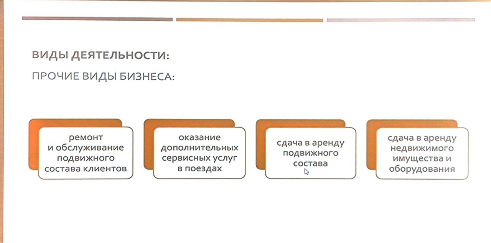  
  
### Конкурентные преимущества поездов дальнего следования  
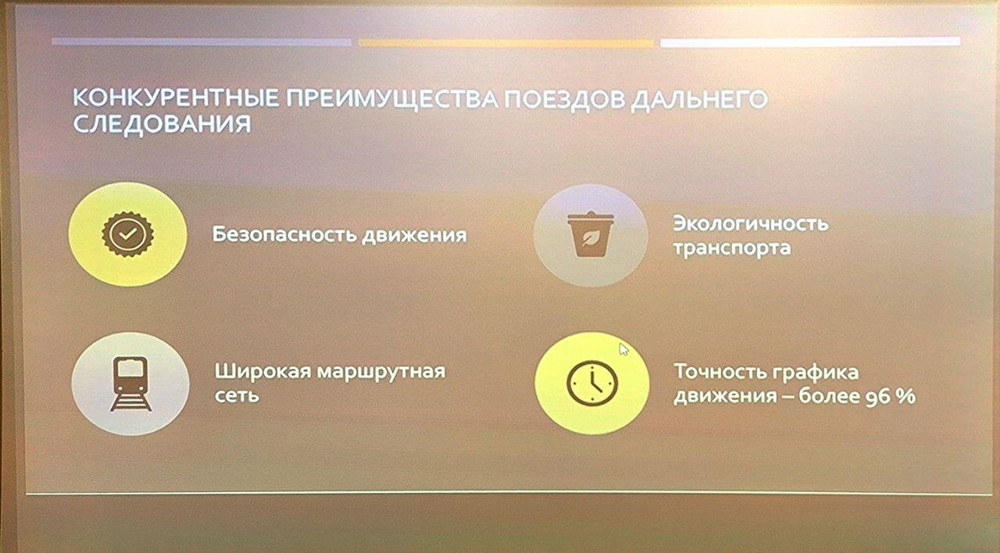  
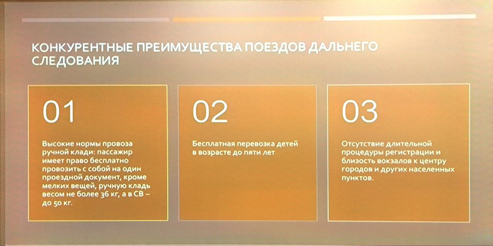  
  
### География деятельности  
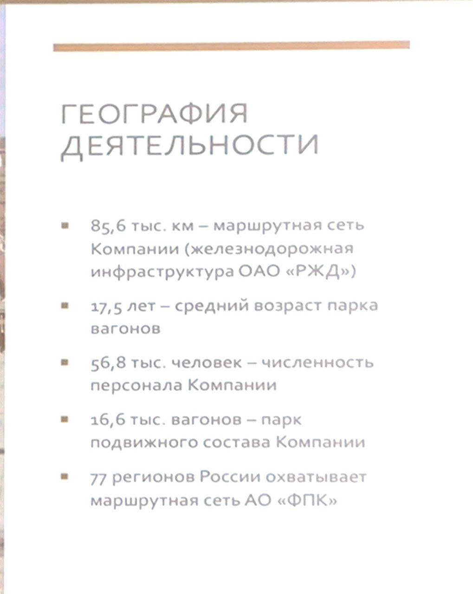  
  
### Основные профессии в АО ФПК  
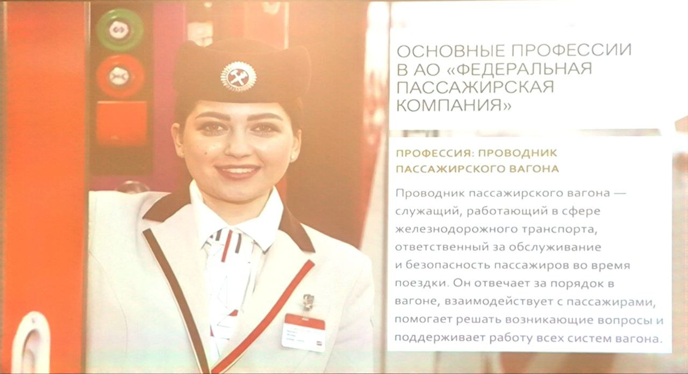  
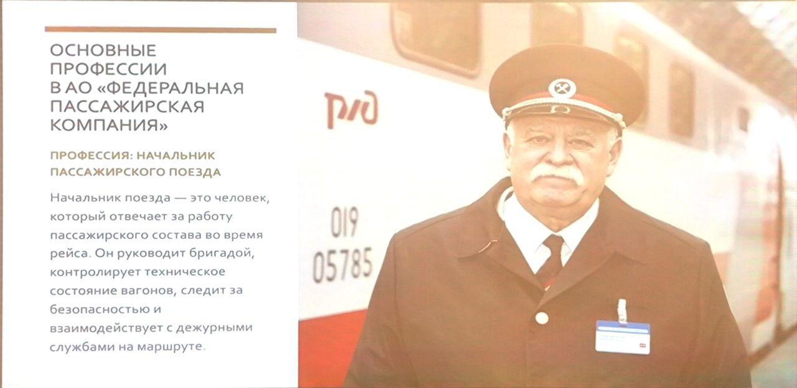  
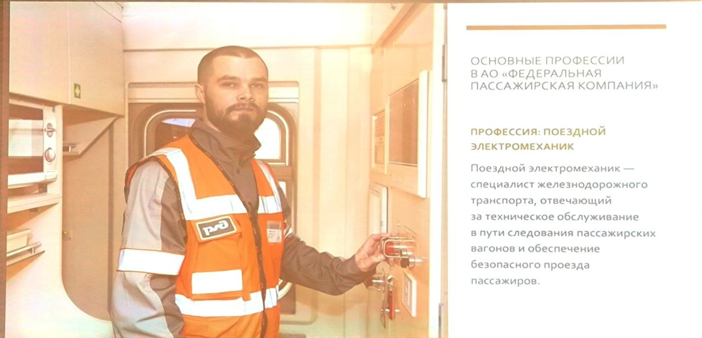  
  
### Структура компании  
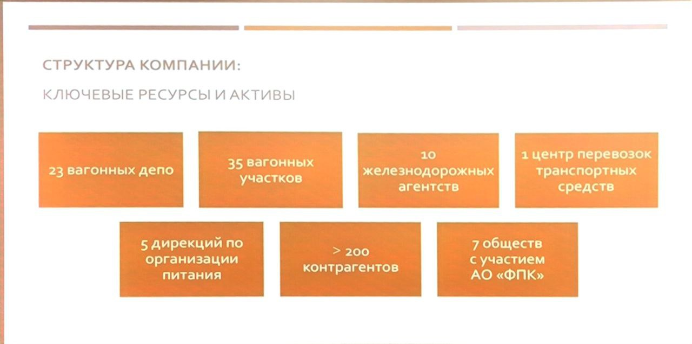  
  
### Миссия и ценности  
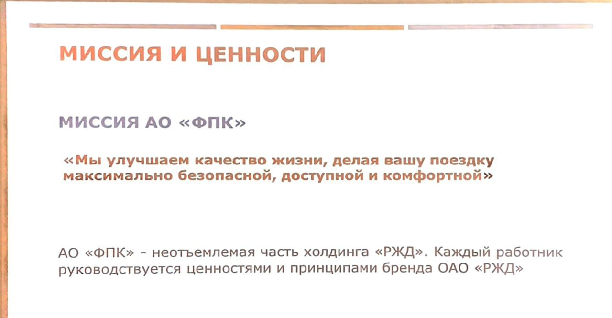  
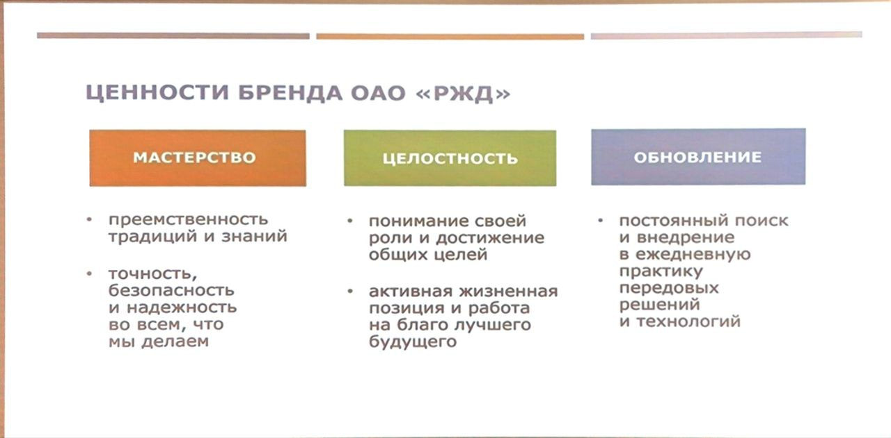  
  
### Корпоративные компетенции проводника  
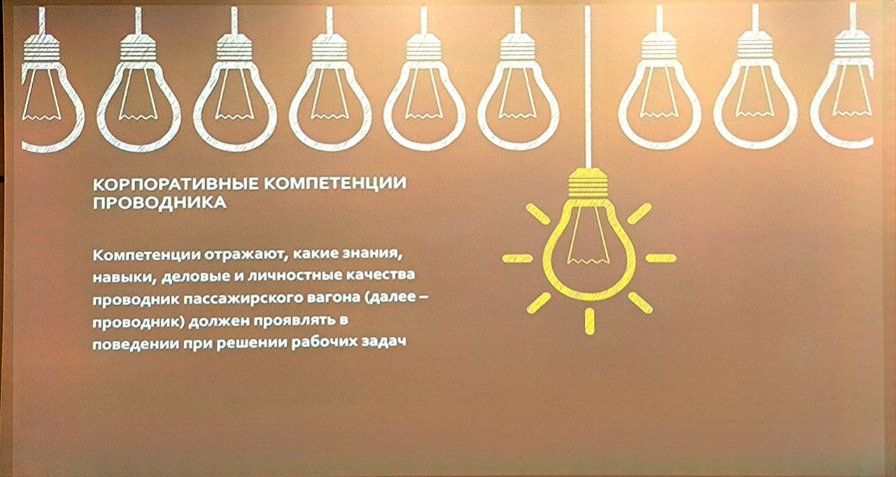  
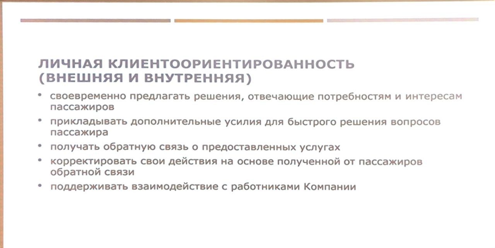  
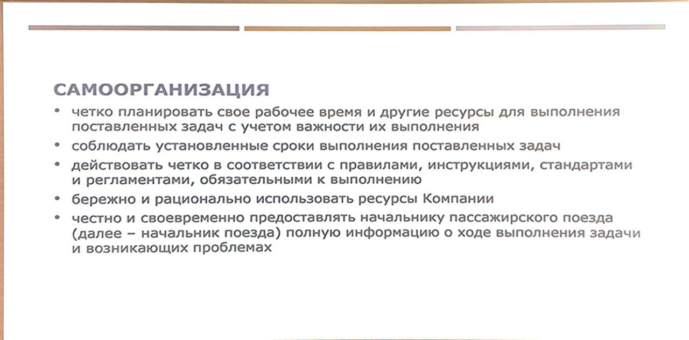  
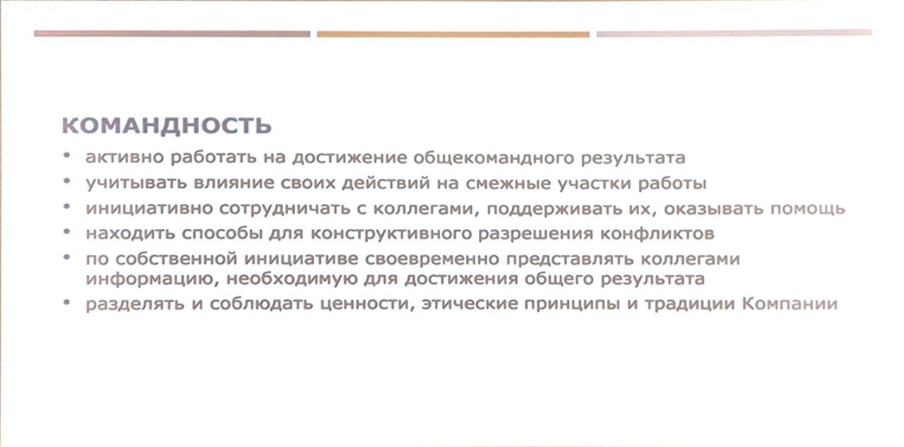